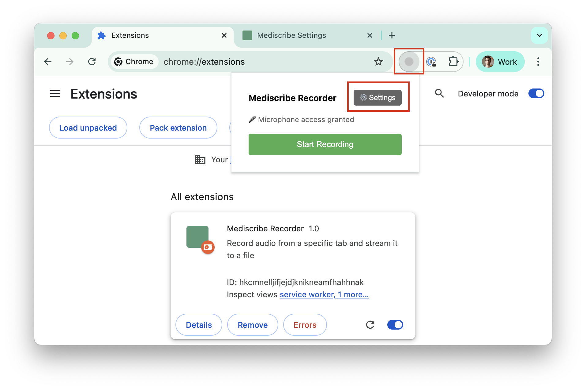
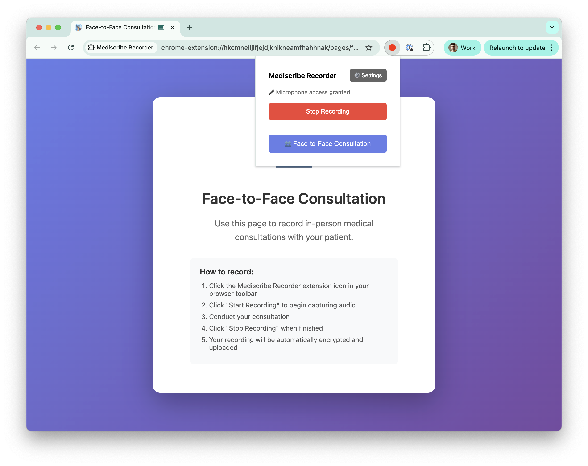

# Mediscribe Recorder Browser Extension


## Description
This browser extension records audio from browser tabs (and optionally microphone) and uploads the recordings to AWS S3. The extension captures tab audio, mixes it with microphone input if available, and automatically uploads the recording to a configured S3 bucket.

## Installation for Users

1. Get the extension zip file
   - Ask the Occupational Health on-call team for the `mediscribe-recorder.zip` file

2. Install the extension in Chrome
   - Open Chrome and go to `chrome://extensions/`
   - Enable "Developer mode" (toggle in top-right)
   - Drag and drop the zip file onto the page (or extract and use "Load unpacked")

3. Open the Settings page
   - Click the extension icon in the toolbar, then click "⚙️ Settings"
   
   

4. Configure settings
   - Enter your credentials:
     - **Health Professional ID** (required - your unique identifier, used in recording filenames)
     - **AWS Access Key ID** (required - see [medical-conversation-recordings-uploader-creds](https://eu-west-3.console.aws.amazon.com/secretsmanager/secret?name=medical-conversation-recordings-uploader-creds&region=eu-west-3))
     - **AWS Secret Access Key** (required - see [medical-conversation-recordings-uploader-creds](https://eu-west-3.console.aws.amazon.com/secretsmanager/secret?name=medical-conversation-recordings-uploader-creds&region=eu-west-3))
     - **AWS Region** (default: eu-west-3)
     - **S3 Bucket Name** (default: occupational-health-medical-conversation-recordings)
     - **Encryption Key** (required - used for AES-256-CBC encryption before upload)
   - **Note:** AWS credentials can be found in [AWS Secret Manager](https://eu-central-1.console.aws.amazon.com/secretsmanager/secret?name=medical-conversation-recordings-uploader-creds&region=eu-central-1)

## Usage

### Recording Online Consultations

1. Navigate to any web page with audio (e.g., YouTube, meeting platform)
2. Click the extension icon
3. Click "Start Recording"
4. Play audio on the tab (and speak into microphone if you want to record both)
5. Click "Stop Recording" when done
6. The upload page opens showing upload progress
7. Click "🎵 Open Recording" to listen to the recording
8. The recording is automatically encrypted and uploaded to S3 at: `s3://[your-bucket]/chrome-extension-audio-recordings/[health-professional-id]-[timestamp].wav.enc`

### Recording Face-to-Face Consultations

For in-person medical consultations where there is no online meeting:

1. Click the extension icon in your browser toolbar
2. Click "👥 Face-to-Face Consultation" to open the dedicated recording page
3. Click the extension icon again (now on the Face-to-Face page)
4. Click "Start Recording" to begin capturing audio
5. Conduct your consultation - the microphone will capture the conversation
6. Click "Stop Recording" when finished
7. The recording will be automatically encrypted and uploaded



## Installation for Developers

### Prerequisites

- Node v20+
- yarn v1.x
- AWS S3 bucket with appropriate permissions
- AWS credentials (Access Key ID and Secret Access Key)

### Setup

1. Install dependencies and run the project
```bash
yarn install
yarn dev
```

2. Load the extension in Chrome
   - Open Chrome and go to `chrome://extensions/`
   - Enable "Developer mode" (toggle in top-right)
   - Click "Load unpacked"
   - Select the `dist` folder

3. Configure AWS credentials and encryption (see "Installation for Users" section above)

## Package for Distribution

To create a distributable package for testing:

```bash
yarn build
cd dist && zip -r ../mediscribe-recorder.zip . && cd ..
```

Share `mediscribe-recorder.zip` with testers who can follow the "Installation for Users" instructions above.

## Project Structure

- `src/pages/offscreen/` (React)
    - Main logic to record audio from a tab and microphone
    - Handles MediaRecorder, AudioContext, and stream mixing
    - Saves recordings to IndexedDB
- `src/pages/popup/` (React)
    - Browser popup with "Start Recording" / "Stop Recording" buttons
    - Shows microphone permission status
    - Settings button to configure AWS credentials
- `src/pages/upload/` (React)
    - Upload page that handles S3 upload via background script
    - Shows upload progress and success/error states
    - Button to open the recorded audio file
- `src/pages/settings/` (React)
    - Settings page for configuring AWS S3 credentials
    - Stores credentials in `chrome.storage.sync`
- `src/pages/permission/` (React)
    - Permission request page for microphone access
- `src/background.ts`
    - Background service worker
    - Handles S3 uploads using AWS SDK
    - Manages offscreen document lifecycle
    - Checks microphone permissions
- `src/scripts/content-script.ts`
    - Content script (currently minimal usage)

## Features

- ✅ Records audio from browser tabs
- ✅ Records microphone input and mixes with tab audio
- ✅ Automatically uploads recordings to AWS S3
- ✅ Shows upload progress with success/error handling
- ✅ Manual button to play the recording
- ✅ Proper cleanup of media streams (supports multiple recordings)
- ✅ Configurable AWS S3 settings via extension options
- ✅ Microphone permission handling
- ✅ Single audio file with combined tab + microphone audio

## Technical Details

### Recording Implementation

The extension uses a **streaming-to-disk** approach for audio recording to handle long consultations without memory limitations:

**File System Storage (OPFS):**
- Audio is written directly to disk using the **Origin Private File System (OPFS)**
- OPFS is a browser-managed private storage area that doesn't consume RAM
- Audio buffers are processed and written to disk in real-time as they're captured
- This enables unlimited recording duration (only limited by disk space, not memory)

**Why Streaming to Disk:**
- **Memory efficiency**: Traditional in-memory recording is limited to ~500MB-1GB before browser crashes
- **No chunking artifacts**: Continuous stream avoids audio cuts between chunks that would occur with chunk-based approaches
- **Long recordings**: Supports multi-hour consultations without performance degradation
- **Real-time processing**: Audio is resampled to 16kHz mono and converted to 16-bit PCM on-the-fly

**Technical Flow:**
1. `ScriptProcessorNode` captures audio buffers (4096 samples at a time)
2. Each buffer is mixed to mono, resampled to 16kHz, and converted to 16-bit PCM
3. PCM data is immediately written to OPFS file via `FileSystemWritableFileStream`
4. WAV header is written at start (placeholder) and updated at end with final size
5. After recording stops, the file remains in OPFS for upload and download
6. File persists in OPFS until browser clears site data or extension is uninstalled

**Upload Process:**
- Recording is read from OPFS as a blob
- Blob is encrypted client-side using AES-256-CBC
- Encrypted data is uploaded to S3 via background script
- Original unencrypted file remains in OPFS for "Download Recording" button

### Recording Process
1. Extension creates an offscreen document to access `getUserMedia` API
2. Captures tab audio using `chrome.tabCapture` API
3. Optionally captures microphone audio
4. Uses Web Audio API (`AudioContext`) to mix both streams into mono
5. Records audio using `ScriptProcessorNode` to capture raw PCM data
6. **Streams audio directly to OPFS file** (no memory buffering)
7. Encodes audio to PCM 16-bit 16kHz WAV format on-the-fly
8. Closes offscreen document after recording completes to free resources

### Upload Process
1. Upload page retrieves blob from OPFS
2. Encrypts audio using AES-256-CBC with PBKDF2 key derivation (OpenSSL compatible)
3. Sends encrypted blob data to background script via message passing (using IndexedDB for large files)
4. Background script uses AWS SDK to upload to S3
5. File is stored at: `chrome-extension-audio-recordings/[health-professional-id]-[timestamp].wav.enc`

### Encryption
- **Algorithm**: AES-256-CBC with PBKDF2 key derivation
- **Compatible with**: `openssl enc -aes-256-cbc -salt -pbkdf2 -k password -d`
- **Format**: OpenSSL format with "Salted__" header + 8-byte salt + encrypted data
- **PBKDF2 iterations**: 10,000 with SHA-256
- Files uploaded to S3 are encrypted before transmission
- The "Open Recording" button plays the unencrypted local copy for verification

#### Decrypting files from S3
To decrypt downloaded files using OpenSSL:
```bash
# Download from S3
aws s3 cp s3://your-bucket/chrome-extension-audio-recordings/HP001-2026-01-28T14-30-00-000Z.wav.enc .

# Decrypt using OpenSSL
openssl enc -aes-256-cbc -salt -pbkdf2 -d -k YOUR_ENCRYPTION_KEY -in HP001-2026-01-28T14-30-00-000Z.wav.enc -out HP001-2026-01-28T14-30-00-000Z.wav

# Play the decrypted file
ffplay HP001-2026-01-28T14-30-00-000Z.wav
```

### Permissions Required
- `activeTab` - Access to current tab
- `tabCapture` - Capture tab audio
- `tabs` - Manage tabs
- `storage` - Store AWS credentials
- `offscreen` - Create offscreen document for recording

## Troubleshooting

### "Cannot capture a tab with an active stream"
- This happens if a previous recording wasn't properly stopped
- Refresh the page and try again
- The extension now properly cleans up streams to prevent this

### "AWS credentials not configured"
- Go to Settings (⚙️ button in popup)
- Enter your AWS credentials
- Credentials are stored securely in Chrome sync storage

### Microphone not recording
- Check Chrome microphone permissions for the extension
- Click extension icon to see permission status
- If denied, go to Chrome settings to enable microphone access

## Development Notes

- Built with Rollup for bundling
- Uses TypeScript and React
- AWS SDK dynamically imported in background script only
- OPFS (Origin Private File System) used for audio file storage during and after recording
- IndexedDB used for metadata and large encrypted data transfer between contexts
- Removed React StrictMode in upload page to prevent double uploads

## License

MIT
